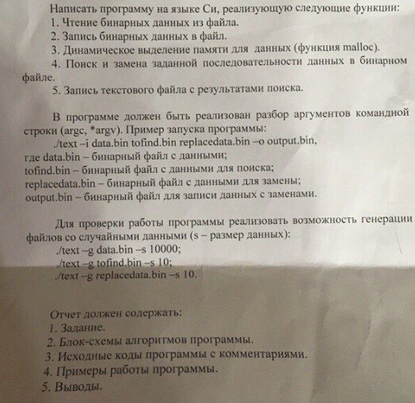

# Задание

<kbd></kbd>

# Примеры работы программы

Компиляция:

```bash
$ gcc -Wall text.c -o text
```

## Пример 1

```bash
$ ./text -g data.bin -s 10
$ hexdump -C data.bin
00000000  f5 87 55 84 1d b9 ae 22  c2 14                    |..U...."..|
```

```bash
$ ./text -g tofind.bin -s 1
$ hexdump -C tofind.bin
00000000  c2                                                |.|
```

```bash
$ ./text -g replacedata.bin -s 1
$ hexdump -C replacedata.bin
00000000  39                                                |9|
```

```bash
$ ./text -i data.bin tofind.bin replacedata.bin -o output.bin
$ cat search-results.txt
pos = 8
$ hexdump -C output.bin
00000000  f5 87 55 84 1d b9 ae 22  39 14                    |..U...."9.|
```

## Пример 2

```bash
$ ./text -g data.bin -s 100
$ hexdump -C data.bin
00000000  6e d4 9a 25 a0 9b 20 cf  86 74 5b 49 1a 14 33 b8  |n..%.. ..t[I..3.|
00000010  a5 04 8f f4 cd 59 f7 48  af a0 33 93 12 28 61 80  |.....Y.H..3..(a.|
00000020  fc fb a6 9c 96 c6 6c 1c  3a c7 65 54 dc 98 0c 81  |......l.:.eT....|
00000030  9c 9b 75 6a f4 6c b2 a3  0d e6 36 1f 0e 97 a0 0b  |..uj.l....6.....|
00000040  92 46 a7 28 0c 13 45 46  db aa 9b b7 43 a7 38 df  |.F.(..EF....C.8.|
00000050  43 ad 49 37 1a fc db 27  e2 11 46 f0 a9 e6 fb 3b  |C.I7...'..F....;|
00000060  2c a3 64 38                                       |,.d8|
```

```bash
$ ./text -g tofind.bin -s 1
$ hexdump -C tofind.bin
00000000  b7                                                |.|
```

```bash
$ ./text -g replacedata.bin -s 3
$ hexdump -C replacedata.bin
00000000  b0 ca 02                                          |...|
```

```bash
$ ./text -i data.bin tofind.bin replacedata.bin -o output.bin
$ cat search-results.txt
pos = 75
$ hexdump -C output.bin
00000000  6e d4 9a 25 a0 9b 20 cf  86 74 5b 49 1a 14 33 b8  |n..%.. ..t[I..3.|
00000010  a5 04 8f f4 cd 59 f7 48  af a0 33 93 12 28 61 80  |.....Y.H..3..(a.|
00000020  fc fb a6 9c 96 c6 6c 1c  3a c7 65 54 dc 98 0c 81  |......l.:.eT....|
00000030  9c 9b 75 6a f4 6c b2 a3  0d e6 36 1f 0e 97 a0 0b  |..uj.l....6.....|
00000040  92 46 a7 28 0c 13 45 46  db aa 9b b0 ca 02 43 a7  |.F.(..EF......C.|
00000050  38 df 43 ad 49 37 1a fc  db 27 e2 11 46 f0 a9 e6  |8.C.I7...'..F...|
00000060  fb 3b 2c a3 64 38                                 |.;,.d8|
```

## Пример 3

```bash
$ cat data.txt
Москва - это самый крупный город в России с самым большим населением.
Москва основана князем Юрием Долгоруким.
```

```bash
$ cat tofind.txt
Москва
```

```bash
$ cat replacedata.txt
Столица Российской Федерации
```

```bash
$ ./text -i data.txt tofind.txt replacedata.txt -o output.txt
$ cat search-results.txt
pos = 0
pos = 126
$ cat output.txt
Столица Российской Федерации - это самый крупный город в России с самым большим населением.
Столица Российской Федерации основана князем Юрием Долгоруким.
```

## Пример 4

```bash
$ hexdump -C data.txt
00000000  41 62 62 61 73 20 47 75  73 65 6e 6f 76 0a 41 62  |Abbas Gusenov.Ab|
00000010  62 61 73 20 47 75 73 65  6e 6f 76 0a 0a           |bas Gusenov..|
```

```bash
$ hexdump -C tofind.txt
00000000  47 75 73 65 6e 6f 76 0a                           |Gusenov.|
```

```bash
$ hexdump -C replacedata.txt
00000000  47 75 73 73 65 6e 6f 76  0a                       |Gussenov.|
```

```bash
$ ./text -i data.txt tofind.txt replacedata.txt -o output.txt
$ cat search-results.txt
pos = 6
pos = 20
$ hexdump -C output.txt
00000000  41 62 62 61 73 20 47 75  73 73 65 6e 6f 76 0a 41  |Abbas Gussenov.A|
00000010  62 62 61 73 20 47 75 73  73 65 6e 6f 76 0a 0a     |bbas Gussenov..|
```
