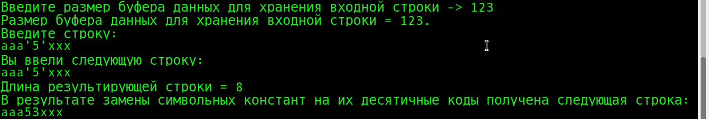
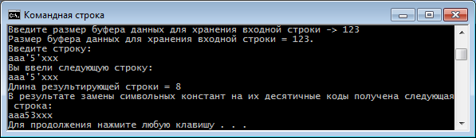

# Problem Statement

Задание реализовать в виде функции, использующей для работы со строкой только указатели и операции над ним вида *p++, p++, p[i] и т.д.. Если функция возвращает строку или ее фрагмент, то это также необходимо сделать через указатель. Нельзя использовать статичные массивы.

Функция находит в строке символьные константы и заменяет их на десятичные коды, например "aaa'6'xxx" на "aaa54xxx".

# Screenshots

<kbd></kbd>

<kbd></kbd>

# Links

- [Solution to Problem When using scanf() before fgets() or gets() in C | Go4Expert](https://www.go4expert.com/articles/solution-using-scanf-fgets-c-t27148/)
- [Problem with scanf() when there is fgets()/gets()/scanf() after it - GeeksforGeeks](https://www.geeksforgeeks.org/problem-with-scanf-when-there-is-fgetsgetsscanf-after-it/)

- [c++ - is that char null terminator is including in the length count - Stack Overflow](https://stackoverflow.com/a/14905963/2289640)

- [Platform independent size_t Format specifiers in c? - Stack Overflow](https://stackoverflow.com/a/22114959/2289640)
- [c - How can one print a size_t variable portably using the printf family? - Stack Overflow](https://stackoverflow.com/a/2524876/2289640)
- [c++ - Cross platform format string for variables of type size_t? - Stack Overflow](https://stackoverflow.com/a/174674/2289640)

- [c - Post-increment on a dereferenced pointer? - Stack Overflow](https://stackoverflow.com/a/859795/2289640)
